# palette-test

This is a comparison of various palette-extracting libraries, on the same image.

## Test 1

### Original image

### Palette by `node-vibrant`

[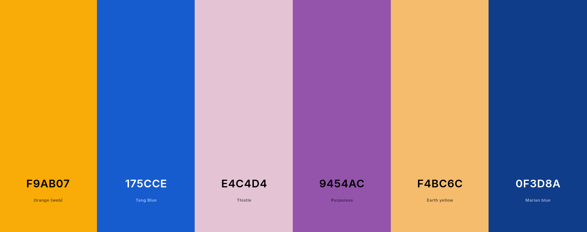](https://coolors.co/f9ab07-175cce-e4c4d4-9454ac-f4bc6c-0f3d8a)

### Palette by `splashy`

[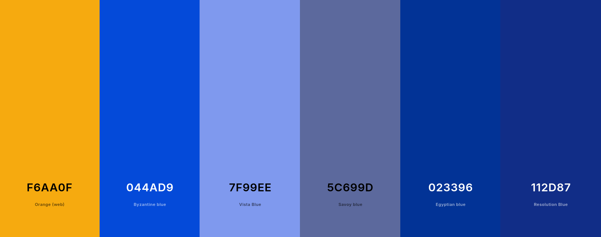](https://coolors.co/f6aa0f-044ad9-7f99ee-5c699d-023396-112d87)

### Palette by `colorthief`

[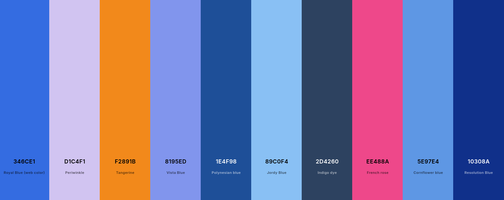](https://coolors.co/346ce1-d1c4f1-f2891b-8195ed-1e4f98-89c0f4-2d4260-ee488a-5e97e4-10308a)

## Test 2

### Original image

### Palette by `node-vibrant`

[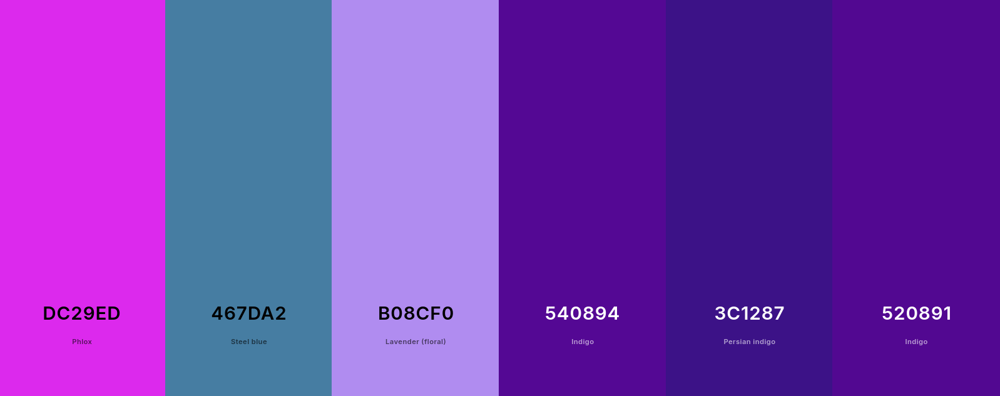](https://coolors.co/dc29ed-467da2-b08cf0-540894-3c1287-520891)

### Palette by `splashy`

[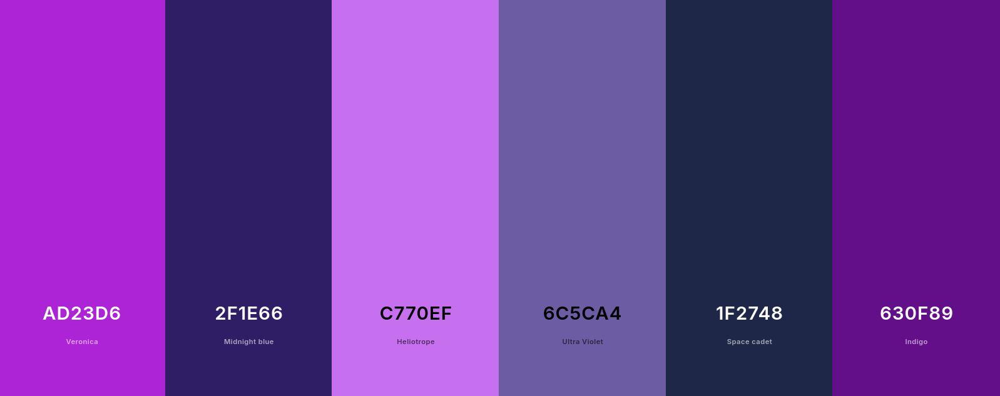](https://coolors.co/ad23d6-2f1e66-c770ef-6c5ca4-1f2748-630f89)

### Palette by `colorthief`

[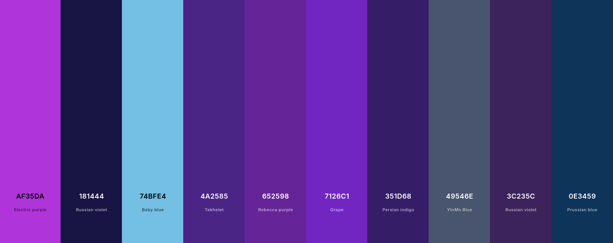](https://coolors.co/af35da-181444-74bfe4-4a2585-652598-7126c1-351d68-49546e-3c235c-0e3459)

## Test 3

### Original image

### Palette by `node-vibrant`

[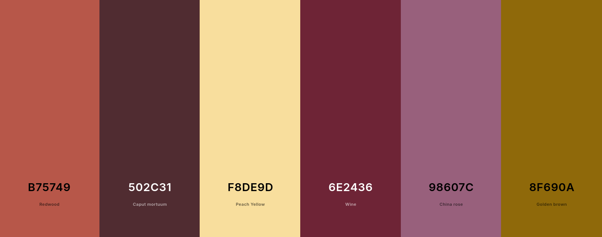](https://coolors.co/b75749-502c31-f8de9d-6e2436-98607c-8f690a)

### Palette by `splashy`

[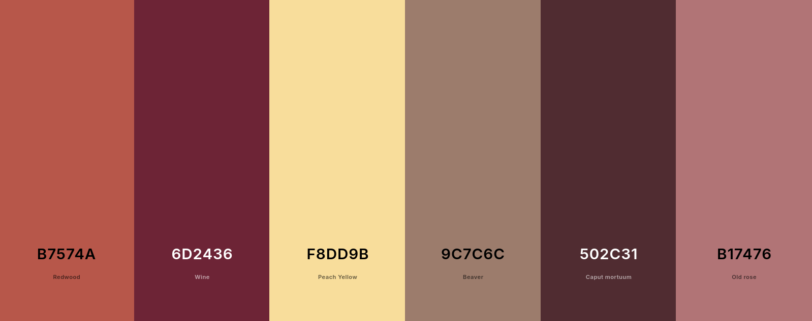](https://coolors.co/b7574a-6d2436-f8dd9b-9c7c6c-502c31-b17476)

### Palette by `colorthief`

[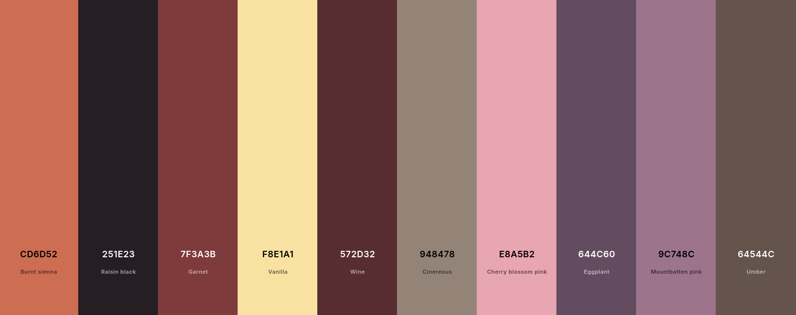](https://coolors.co/cd6d52-251e23-7f3a3b-f8e1a1-572d32-948478-e8a5b2-644c60-9c748c-64544c)

## Test 4

### Original image

### Palette by `node-vibrant`

[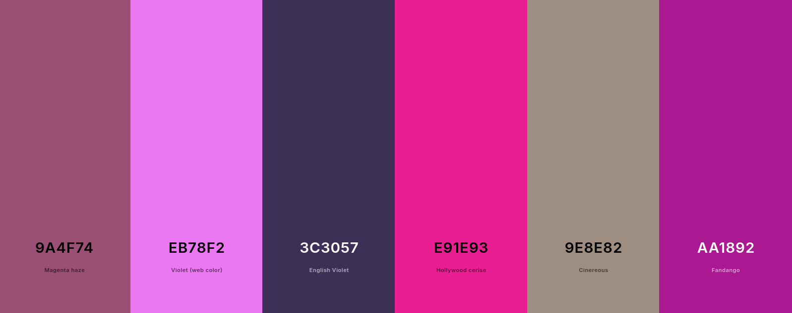](https://coolors.co/9a4f74-eb78f2-3c3057-e91e93-9e8e82-aa1892)

### Palette by `splashy`

[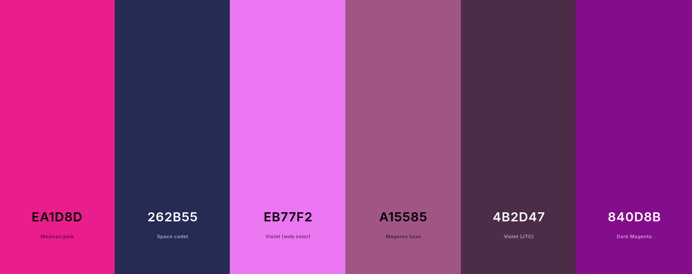](https://coolors.co/ea1d8d-262b55-eb77f2-a15585-4b2d47-840d8b)

### Palette by `colorthief`

[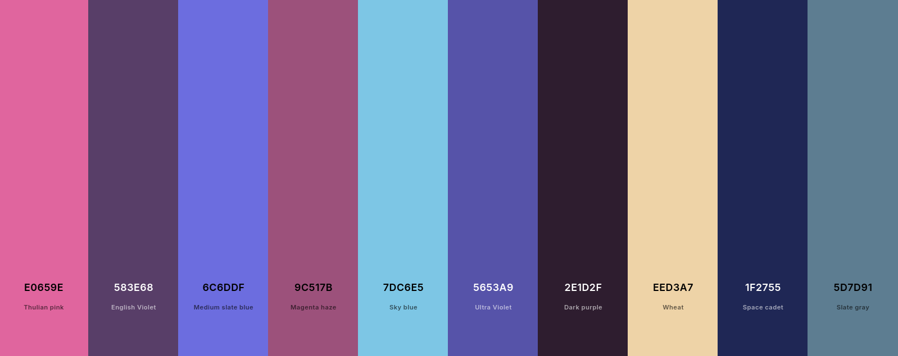](https://coolors.co/e0659e-583e68-6c6ddf-9c517b-7dc6e5-5653a9-2e1d2f-eed3a7-1f2755-5d7d91)
