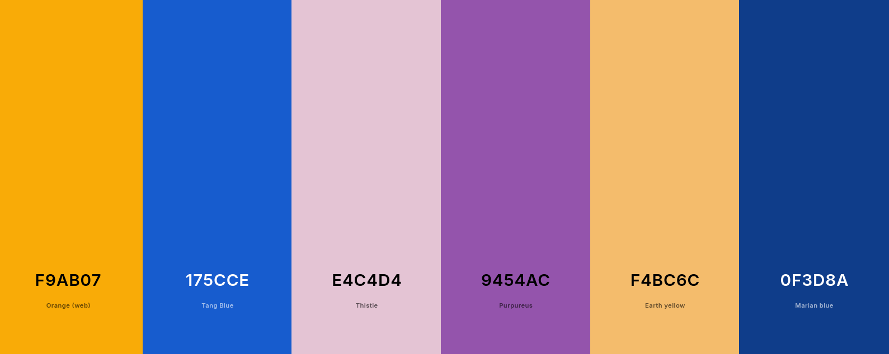
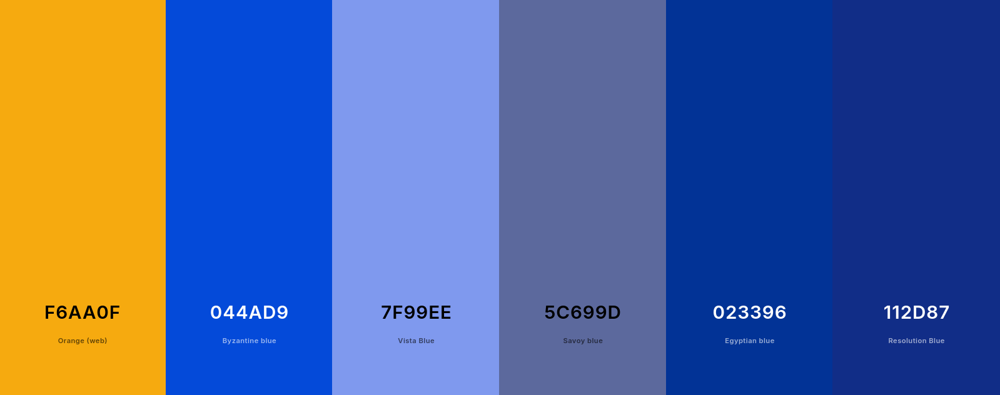

# palette-test

This is a comparison of various palette-extracting libraries, on the same image.

### Original image

### Palette by `node-vibrant`

### Palette by `splashy`

### Palette by `colorthief`

